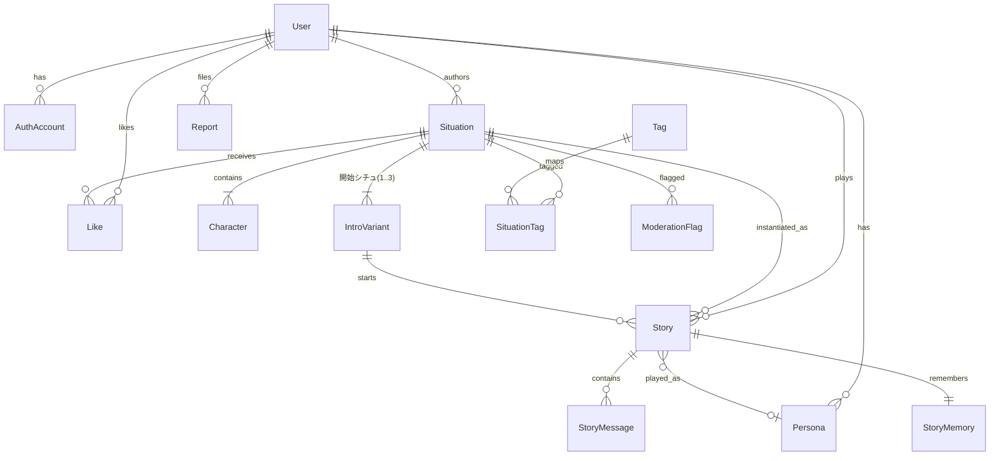

# 02. Data Schema (Bukucha MVP)

- version: 1
- source: ../teardown.md §5 / ../decisions.md / ../nsfw-analysis.md
- DB: PostgreSQL + Prisma [ASSUMED: 国内向けWebスタックの標準構成。build時に変更可]
- 方針: シチュエーション(Situation)が第一階級。キャラはその子。1プレイスルー=Story(本棚の1冊)。
- NSFW: `ContentLevel` 3値を最初から持つ(MVPでは R18 を使わないだけ)。フィルタはサーバー側で制御(`decisions.md` NSFW決定#3)

## Prisma Schema

```prisma
generator client {
  provider = "prisma-client-js"
}

datasource db {
  provider = "postgresql"
  url      = env("DATABASE_URL")
}

// ============ enums ============

enum ContentLevel {
  ALL_AGES // 全年齢
  R15      // 寸止め(Zeta同等ライン)。安心フィルターOFF(=年齢確認済み)のみ閲覧可
  R18      // MVPでは未使用。派生(variants/web-r18-variant.md)用に予約
}

enum SituationStatus {
  DRAFT     // 下書き(本人のみ)
  PUBLISHED // 公開
  PRIVATE   // 非公開(本人のみプレイ可)
  SUSPENDED // 運営停止(モデレーション)
}

enum StoryStatus {
  ACTIVE
  ARCHIVED // 本棚の「完結」タブ
}

enum MessageRole {
  USER
  AI
  SYSTEM // イントロ、あらすじ挿入など
}

enum ModerationKind {
  IP_DETECTED       // 二次創作/既存IP検出(禁止 → 公開ブロック)
  CONTENT_OVER_LINE // 寸止めライン超過
  BANNED_EXPRESSION // 規約禁止表現(未成年性描写・実在人物等)
}

enum ModerationStatus {
  FLAGGED
  APPROVED // 人手レビューで問題なし
  REJECTED // 確定違反 → 対象を SUSPENDED に
}

enum ReportStatus {
  OPEN
  RESOLVED
  DISMISSED
}

// ============ User / Auth ============

// teardown: USER
model User {
  id             String    @id @default(cuid())
  email          String?   @unique
  nickname       String    // 表示名。初期値は自動生成(例: "読者A1B2")
  avatarUrl      String?
  birthDate      DateTime? // 年齢確認。null = 未確認 = 安心フィルター強制ON
  safeFilterOff  Boolean   @default(false) // trueにできるのは birthDate で18歳以上のみ(サーバー側で強制)
  preferenceTags String[]  // SCR-001で選んだ嗜好タグ名
  suggestDate    String?   // AIF-008 返信候補クォータのdateKey(UTC日付=朝9時JSTリセット)
  suggestUsed    Int       @default(0) // 当日の返信候補使用回数
  isCreatorBadge Boolean   @default(false) // 将来: 認定クリエイター
  role           String    @default("USER") // USER | ADMIN
  createdAt      DateTime  @default(now())
  updatedAt      DateTime  @updatedAt

  accounts   AuthAccount[]
  personas   Persona[]
  situations Situation[]
  stories    Story[]
  likes      Like[]
  reports    Report[]
}

// NextAuth互換 [ASSUMED: Auth.js利用。Google/Apple/メール(magic link)]
model AuthAccount {
  id                String @id @default(cuid())
  userId            String
  provider          String // google | apple | email
  providerAccountId String
  user              User   @relation(fields: [userId], references: [id], onDelete: Cascade)

  @@unique([provider, providerAccountId])
}

// teardown: PERSONA(ユーザー側の「わたし」設定)
model Persona {
  id        String  @id @default(cuid())
  userId    String
  name      String  // 作中での自分の名前(夢小説の名前変換に相当)
  callName  String? // キャラからの呼ばれ方(例: "お前", "〇〇さん")
  profile   String? // 自由記述(容姿・設定)。AIプロンプトに注入
  isDefault Boolean @default(false)
  user      User    @relation(fields: [userId], references: [id], onDelete: Cascade)
  stories   Story[]
}

// ============ Situation (第一階級) ============

// teardown: SITUATION
model Situation {
  id            String          @id @default(cuid())
  authorId      String
  title         String          // 例: "3年ぶりに帰還した夫は私を毒婦と呼びました"
  catchphrase   String          // カード用の一言(60字以内)
  worldSetting  String          // 世界観・設定(長文)。AIプロンプトの土台
  coverImageUrl String?         // MVPはアップロード or 運営プリセットから選択
  contentLevel  ContentLevel    @default(ALL_AGES)
  status        SituationStatus @default(DRAFT)
  aiDraftInput  String?         // AIF-002に入力した「妄想の一文」(再生成用に保持)
  publishedAt   DateTime?
  createdAt     DateTime        @default(now())
  updatedAt     DateTime        @updatedAt

  // 集計(非正規化。書き込みはサーバーのみ)
  likeCount   Int @default(0)
  storyCount  Int @default(0) // 開始されたStory数(ランキング指標)
  readerCount Int @default(0) // ユニーク読者数

  author     User             @relation(fields: [authorId], references: [id])
  characters Character[]
  intros     IntroVariant[]
  tags       SituationTag[]
  stories    Story[]
  likes      Like[]
  flags      ModerationFlag[]

  @@index([status, contentLevel, publishedAt])
  @@index([authorId])
}

// teardown: CHARACTER(Situationの子。単体では存在しない)
model Character {
  id              String  @id @default(cuid())
  situationId     String
  name            String
  profileImageUrl String?
  personality     String  // 性格
  speechStyle     String  // 口調(一人称・語尾・敬語等)
  relationship    String  // 主人公({user})との関係性
  exampleDialogs  Json    // [{user: "...", char: "..."}] few-shot(最大5組)
  sortOrder       Int     @default(0) // 0 = 主演
  situation       Situation @relation(fields: [situationId], references: [id], onDelete: Cascade)
}

// teardown: INTRO_VARIANT(開始シチュエーション、最大3)
model IntroVariant {
  id           String @id @default(cuid())
  situationId  String
  label        String // 例: "放課後の教室で"
  introText    String // 導入の地の文(ノベル冒頭)
  firstMessage String // キャラの最初の応答(地の文+セリフ)
  sortOrder    Int    @default(0)
  situation    Situation @relation(fields: [situationId], references: [id], onDelete: Cascade)
  stories      Story[]
}

// teardown: TAG(欲望タグを第一階級に)
model Tag {
  id       String  @id @default(cuid())
  name     String  @unique // 例: "溺愛", "執着", "幼なじみ", "身分差"
  category String  // desire(欲望) | genre | relationship
  isR15    Boolean @default(false) // trueは安心フィルターON時に非表示
  situations SituationTag[]
}

model SituationTag {
  situationId String
  tagId       String
  situation   Situation @relation(fields: [situationId], references: [id], onDelete: Cascade)
  tag         Tag       @relation(fields: [tagId], references: [id], onDelete: Cascade)

  @@id([situationId, tagId])
}

// ============ Story (プレイスルー = 本棚の1冊) ============

// teardown: SESSION → 「Story」に命名(本棚メタファ) [USER-REQ]
model Story {
  id                  String      @id @default(cuid())
  userId              String
  situationId         String
  introVariantId      String
  personaId           String?
  status              StoryStatus @default(ACTIVE)
  choicesEnabled      Boolean     @default(true)  // AIF-005 選択肢のON/OFF(Zetaの途中切替を踏襲)
  useMidModel         Boolean     @default(false) // 高品質モデル(mid)切替(Zetaのkoji/luca相当の2段構成)
  lastRecap           String?     // AIF-004: 前回までのあらすじ(キャッシュ)
  lastRecapAtIdx      Int         @default(0) // recap生成時点のメッセージidx
  branchedFromStoryId String?     // IFルート派生元(MVPではUI無し、データだけ準備)
  lastMessageAt       DateTime    @default(now())
  createdAt           DateTime    @default(now())

  user         User          @relation(fields: [userId], references: [id], onDelete: Cascade)
  situation    Situation     @relation(fields: [situationId], references: [id])
  introVariant IntroVariant  @relation(fields: [introVariantId], references: [id])
  persona      Persona?      @relation(fields: [personaId], references: [id])
  messages     StoryMessage[]
  memory       StoryMemory?

  @@index([userId, lastMessageAt])
}

// teardown: MESSAGE
model StoryMessage {
  id             String      @id @default(cuid())
  storyId        String
  idx            Int         // Story内連番(0始まり)。巻き戻し = idx以降を isDeleted
  role           MessageRole
  content        String      // ノベル本文(地の文+「」セリフ)
  choices        Json?       // AIF-005: [{id, text}] 提示した選択肢
  selectedChoice String?     // ユーザーが選んだ選択肢id(自由入力ならnull)
  isDeleted      Boolean     @default(false) // 巻き戻しで論理削除(復元可能に)
  modelUsed      String?     // LLM抽象化レイヤが記録
  createdAt      DateTime    @default(now())

  story Story @relation(fields: [storyId], references: [id], onDelete: Cascade)

  @@unique([storyId, idx])
}

// teardown: MEMORY(要約メモリ+ユーザーノートの二層)
model StoryMemory {
  storyId        String @id
  summary        String @default("") // AIF-003: rolling summary(自動)
  summaryAtIdx   Int    @default(0)  // 要約済み位置
  userNote       String @default("") // ユーザー手書きの恒久設定
  story          Story  @relation(fields: [storyId], references: [id], onDelete: Cascade)
}

// ============ Social ============

// teardown: LIKE
model Like {
  userId      String
  situationId String
  createdAt   DateTime @default(now())
  user        User      @relation(fields: [userId], references: [id], onDelete: Cascade)
  situation   Situation @relation(fields: [situationId], references: [id], onDelete: Cascade)

  @@id([userId, situationId])
}

// ============ Trust & Safety ============

// teardown: REPORT
model Report {
  id         String       @id @default(cuid())
  reporterId String
  targetType String       // situation | message
  targetId   String
  reason     String       // 定型: 二次創作 | 過度な性的表現 | 実在人物 | その他
  detail     String?
  status     ReportStatus @default(OPEN)
  createdAt  DateTime     @default(now())
  reporter   User         @relation(fields: [reporterId], references: [id])
}

// teardown: MODERATION_FLAG(AIF-006/007が書き込む)
model ModerationFlag {
  id          String           @id @default(cuid())
  situationId String?          // 公開前チェック対象
  targetType  String           // situation | message
  targetId    String
  kind        ModerationKind
  detail      String           // 検出根拠(例: 検出したIP名)
  status      ModerationStatus @default(FLAGGED)
  createdAt   DateTime         @default(now())
  situation   Situation?       @relation(fields: [situationId], references: [id], onDelete: Cascade)
}
```

## ER図



## 不変条件(サーバー側で強制)

1. `safeFilterOff = true` は `birthDate` が18歳以上の場合のみ設定可(SCR-018)
2. 安心フィルターON(またはbirthDate未設定)のユーザーへのレスポンスから `contentLevel = R15` のSituation/タグを常に除外(ホーム/検索/詳細/直リンク全て。フィルタはAPI層で一元化)
3. `Situation.status = PUBLISHED` への遷移は AIF-006(公開前チェック)通過が必須。`ModerationKind = IP_DETECTED` があれば遷移不可(二次創作禁止 [USER-REQ])
4. `IntroVariant` は1 Situationにつき1〜3件。`Character` は1〜3件 [ASSUMED: MVP上限。コスト・UI簡素化]
5. `StoryMessage.idx` はStory内で連番。巻き戻しは論理削除のみ(物理削除しない)
6. 集計カラム(likeCount等)の更新はトランザクション内でインクリメント(集計クエリをリクエスト経路に置かない)
```
