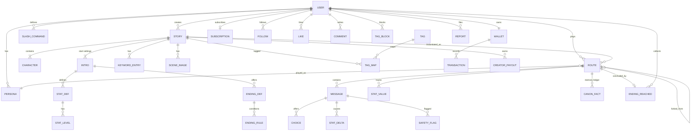

# Teardown: OOC — The Playable Anime (ooc.ai)

- source_urls: [https://ooc.ai/, https://help.ooc.ai/, https://apps.apple.com/us/app/ooc-the-playable-anime/id6761247061, https://play.google.com/store/apps/details?id=com.newai.ooc, https://www.businesswire.com/news/home/20260415199414/en/]
- date: 2026-08-28
- supersedes: 旧teardown(キャラぷ/Zeta/DMM・日本女性向け)。**ベンチマークと市場を全面差し替え**
- user_requirements: **ベンチマークを OOC に一本化。市場を北米(US+CA)に限定して最適化。ドキュメントもコードも全て。徹底的に分解してスーパークローンし、超える** [USER-REQ]
- confidence: **high** — 公式LP / ヘルプセンター / App Store / Google Play / 公式PR / **Web版JSバンドルから抽出した全APIルート**を一次情報として使用
- 生データ: `research/ooc.md`(製品分解)/ `research/na-market.md`(市場・規制)
- 旧資産の扱い: `research/kyarapu.md` は **OOC の日本版=同一エンジン**のため引き続き有効。`research/zeta.md` `research/dmm-chara-chat.md` `research/nsfw-female-market.md` は日本市場資料として保存(北米版では参照しない)

---

## 0. なぜ OOC が正しいベンチマークなのか

OOC は Wrtn Technologies(韓国)の**同一エンジンの北米版ブランド**である。韓国=Crack、日本=キャラぷ、北米=OOC。
旧teardownで分解したキャラぷは、そのエンジンの日本版だった。**つまり我々は既にエンジンの内部構造を知っている。**

そのうえで OOC は、**ローンチ4ヶ月で米国 Google Play の Simulation 売上6位**に入っている。
北米で「構造化された遊べる物語」に金が動くことを、既に証明してくれている。

そして最も重要なのは、**否定レビューの内訳が異常に偏っている**ことだ:

| 否定意見(150件分析中61件) | 比率 |
|---|---|
| クレジットが高い + 無料枠が少ない + 攻撃的な収益化 | **合計 約69%** |
| **AIが記憶を失う** | **23%** |
| バグ・機能の破損 | 12% |

**不満の実質すべてが「金」と「記憶」の2つに集約されている。文章品質・世界観・UIへの不満はほぼない。**
これは「作れば勝てる」市場ではなく、**「同じものを作って、この2点だけを正しく設計すれば勝てる」市場**だということだ。

さらに市場構造として、**どのプラットフォームも約18ヶ月を超えてカテゴリ首位を維持できていない**
(Character.AI は2025年初頭のピークから約40%減、Talkie も同様、PolyBuzz はスパイク後に冷却)。
OOC はまだ4ヶ月。**首位交代の窓は開いている。**

## 1. Positioning

### OOC のポジショニング
> **"THE PLAYABLE ANIME"** — アニメを観るのでも Web 小説を読むのでもなく、**その中に入って主人公として演じる**。

App Store 説明文冒頭(逐語): *"Dive into an immersive adventure where you don't just read the webnovel—you step inside it."*
CEO Seyoung Lee: *"Users aren't just chatting with a character, they are entering a narrative world where they are the protagonist."*

**上手い**。「AIチャット」でも「AIガールフレンド」でもなく、**新カテゴリ名を宣言している**。
機能リストではなくカテゴリで戦うことで、Character.AI との比較土俵から降りている。ここは**そのまま学ぶべき**。

### 我々のポジショニング [USER-REQ]
> **"Your headcanon, playable — and it never forgets."**
> **あなたの headcanon(自分だけの解釈・自分だけのルート)が、遊べる物語になる。そして二度と忘れられない。**

`headcanon` は北米ファンダムのネイティブ語彙で、「公式ではないが自分の中では真実である物語」を指す。
**OOC(= out of character、なりきりから外れること)の対義概念**であり、同じ語彙圏で真正面から名指しできる。

3層の主張:
1. **Playable(同格)**: stat / endings / route を持つ構造化された遊べる物語。OOC が作った土俵に乗る
2. **Persistent(優位)**: 物語の事実は**永続する台帳**に載る。忘れないし、直すのは無料
3. **Fair(優位)**: 定額で無制限に読める。**続きを読むために毎回財布を意識させない**

ターゲット: **北米の 16〜34歳、アニメ/マンガ/JRPG/インタラクティブフィクション層**。
とくに **AO3 / Wattpad / SillyTavern / r/CharacterAI に既にいる、"書く側にもなり得る" 読者**。
彼らは Character.AI のフィルタに疲れ、Janitor AI の摩擦に疲れ、**OOC の課金メーターに疲れている**。

## 2. Feature Map(OOC の実装 — APIルートとヘルプセンターから確定)

★ = コア / ◆ = OOC の実装が弱い、または我々が超える点

- **Play(遊ぶ)**
  - ★ **Story Mode**: 作者が構造を作り込んだ物語をシーン単位で進める。クレジット消費が大きい
  - ★ **Character Mode**: 自由チャット。**Basic モデルは無料無制限**(= 獲得のための撒き餌)
  - ★ Premium Mode: キャラチャットの上位モード。**20 credits/回**
  - ★ **Stat システム**: 好感度/HP/戦闘力などの数値。**最大7個**、Level最大4段。**stat が変わると AI の口調と振る舞いが変わる**
  - ★ **Endings**: **N/R/SR/SSR のレアリティ**。10ターン以降・5ターンごとに条件判定。到達で**カードがコレクションとして積み上がる**、上位5件にランキングバッジ
  - ★ Scene Images: `{{img: ImageName}}` で発火。**Intro あたり最大50枚**、事前登録型(低レイテンシ) + 非同期の画像生成API
  - Response Suggestions: 返信候補。未指定ならAIが自動生成、手動なら最大3件
  - **Play Guide**: ユーザーにだけ見えて **AI は記憶しない**ガイド文。メタ情報とフィクションを分離する良い発明
  - **Slash Commands**: ユーザー定義の定型指示 + **共有ハブで他人のコマンドを検索・入手できる**
  - ◆ **Memory**: Keyword Book(**同時アクティブ最大3件**)+ User Notes。"Deep Memory" と宣伝しながら**否定レビューの23%が記憶欠落**
- **Create(作る)**
  - ★ **Story Builder 8段階**: Profile → Basic → Intro → Stat → Media → Keyword Book → Endings → Publish
  - ★ **Character Builder 5段階**: Setup → Intro → Prompt → Advanced(画像) → Details
  - ★ **AI下書き支援が9エンドポイント**(detail / initial-message / conversation-example / **epilogue-example** / parameter-description / character prompt / intro-message / example-message)。**全項目に「AIが書く」がある**
  - Default Prompt(AIが広く解釈) / Custom Prompt(全指示を自分で書く)の二択
  - **複数 Intro**(例: School Days / College Years / After Marriage)= 同一世界の入口を複数持つ
  - 公開範囲: Public / **Link Only** / Private
- **Discover(見つける)**
  - フィード / ジャンル / タグ検索 / キーワードランキング / 作品ランキング / キャラランキング
  - 推薦が4系統: 新規向け / 類似 / 行動ベース / **デイリーチェックイン連動**
  - ◆ **`/block/tag` = タグ単位のブロック**。「このタグはもう出さない」。地味だが極めて強い
  - ◆ **発見がアプリ内で閉じている**。SPA で作品ページが検索エンジンに存在しない
- **Community(つながる)**
  - フォロー / いいね / コメント / クリエイター公開ページ
  - ◆ **Certified Creator への door が異常に高い**(§7)
- **Retain(続ける)**
  - デイリーチェックイン(`/attendance`)/ ミッション(`/assignments`)/ チュートリアル報酬(`/tutorials`)/ 通知 / お知らせ
  - **未登録での試し打ち**(`/character-temp-chats` `/temp-stories`)= 登録壁の後置き
- **Monetize(払う)**
  - ◆ **クレジット従量のみ。サブスクリプションが存在しない**(レビュー最多要望)
  - **Web は Stripe 直結**(ストア手数料回避)、ストアは IAP
  - Credit History を **購入履歴 / 消費履歴に分離表示**(誠実な設計)
  - ◆ **退会で残クレジット全額失効・返金不可**
- **Trust & Safety**
  - General Content(全年齢・性的表現一切不可)/ **Adult Content(認証済みのみ)** の二層
  - Google / Apple ソーシャルログイン、ブロック管理、通報
  - ◆ **App Store 13+ のまま Adult 層を持つ**。北米の規制強化局面で構造的リスク

## 3. Screen Inventory

由来: **O** = OOC で確認(APIルート/ヘルプ/ストア)、**N** = 我々の新規提案

| ID | Screen | Purpose | Key UI | Nav to | 由来 |
|---|---|---|---|---|---|
| SCR-001 | Onboarding | 嗜好取得と即体験 | ジャンル選択 → **Content Preference**(*"Select the type of content you'd like to see."*)→ おすすめ3件 → **登録前に数ターン試遊** | SCR-006 | O |
| SCR-002 | Home Feed | 発見・回遊 | 検索バー、ジャンルナビ、セクション型カードフィード(For You / New / Following / Trending / **Daily Pick**) | SCR-003/004/005 | O |
| SCR-003 | Search & Tags | 到達 | キーワード検索、トレンドキーワード、**AO3型タグ**、履歴、**タグブロック** | SCR-005 | O |
| SCR-004 | Rankings | 社会的証明 | Stories / Characters / Keywords の3タブ × 期間 | SCR-005 | O |
| SCR-005 | Story Detail | 開始前の期待醸成 | カバー、ログライン、タグ、登場キャラ、プロローグ抜粋、**Intro(開始設定)選択**、**Endings 進捗(◇◇◆◇)**、Play CTA、コメント、作者リンク | SCR-006 | O |
| SCR-006 | ★ **Play (Reader)** | 本体験 | 全画面没入。二人称の地の文 + `"…"` セリフのストリーミング、`*…*` 行動入力、選択肢、返信候補、空送信=続き、リロール/指示付き再生成/編集/巻き戻し、シーン画像インライン、**Stat HUD**、右上メニュー(Canon / Play Guide / Route / Settings) | SCR-005/007/008/021/022/024 | O |
| SCR-007 | Library | 再開・積読 | 進行中カード + **"Previously on…" 自動あらすじ** + 未読バッジ。タブ(Playing / Finished / Saved) | SCR-006 | O |
| SCR-008 | **Route Map** | IF周回の可視化 | 同一作品のルート一覧、分岐点、**任意ターンからのフォーク**、ルート比較 | SCR-006 | **N** ◆ |
| SCR-009 | ★ Story Builder | UGCの核 | ウィザード: Premise(一文)→ **AI一括下書き** → Basic → Intro(複数)→ **Stat** → Media → **Keyword Book** → **Endings** → Publish。全項目にAI生成ボタン、テストプレイ | SCR-010/011/012/021/022 | O |
| SCR-010 | Character Builder | 作成内サブ | 名前・画像・性格・口調・関係・会話例・シーン画像 | SCR-009 | O |
| SCR-011 | Keyword Book | 世界観辞書 | キーワード + 本文 + 適用範囲。**OOCの「同時3件」制限を撤廃** | SCR-009 | O ◆ |
| SCR-012 | My Titles (Creator) | 書き手の承認ループ | 作品リスト、プレイ数/読者数/いいね/完走率、**Ending 到達分布**、**収益ダッシュボード** | SCR-009/013 | O ◆ |
| SCR-013 | Creator Page | 公開作家ページ | アバター、bio、作品グリッド、フォロワー、**SSR/OGP でインデックス可能** | SCR-005 | O ◆ |
| SCR-014 | My Page | アカウントハブ | プロフィール、**Personas**、いいね、フォロー、残高/プラン、Endings コレクション導線 | SCR-018/022 | O |
| SCR-015 | **Plans & Credits** | マネタイズ | **サブスク主・クレジット従**。プラン比較、残高、購入/消費履歴の分離 | 決済 | O ◆ |
| SCR-016 | Rewards | 無課金導線 | デイリーチェックイン、ミッション、チュートリアル報酬 | SCR-015 | O |
| SCR-017 | Sign In | 認証 | Continue with Google / Apple / Email | SCR-002 | O |
| SCR-018 | Settings | 安全と嗜好 | Account、**生年月日と年齢認証**、Content Preference、通知、テーマ、**Slash Commands**、**Block management(ユーザー/タグ)**、法令リンク | — | O |
| SCR-019 | Notifications | 再訪の入口 | 物語の続き通知、いいね/コメント/フォロー、運営告知 | SCR-006/012 | O |
| SCR-020 | Legal | 法令対応 | ToS / Privacy / DMCA / **CCPA-CPRA** / **PIPEDA** / Content Policy / Community Guidelines | — | O ◆ |
| SCR-021 | Stat Panel | 数値の可視化 | HUD + 詳細シート。stat 名/アイコン/現在値/レベル名/**直近の増減理由** | SCR-006 | O ◆ |
| SCR-022 | **Endings Collection** | コンプ欲 | 到達済み/未到達(ヒントのみ)のカードグリッド、レアリティ、到達率、**共有画像生成** | SCR-005/006 | O ◆ |
| SCR-023 | Slash Commands | 上級者の武器 | 自作コマンド管理 + **共有ハブ検索・インポート** | SCR-018 | O |
| SCR-024 | **Canon (Memory Ledger)** | ◆ **最大の差別化** | 物語の確定事実の一覧。AIが自動抽出、ユーザーが編集/ピン/削除。カテゴリ(人物・関係・約束・世界設定・出来事)。**編集は常に無料** | SCR-006 | **N** ◆ |
| SCR-025 | Intermission | 規制対応を体験に | セッション時間に応じた小休止画面。**「これはAIです」の開示**、休憩提案、あらすじ、危機リソース | SCR-006 | **N** ◆ |

**24画面 + 1**。OOC は10画面では収まらない、成熟した構造を持っている。

レイアウト方針: **SPファースト**は維持(モバイルが主戦場)。ただし PC は中央480px固定をやめ、
**PC では Reader を左右2ペイン(本文 / Stat・Canon サイドバー)に拡張する**。
北米は日本よりデスクトップ比率が高く、SillyTavern 文化圏は PC が主戦場だからだ [USER-REQ: 北米最適化]。

## 4. User Flows

- **FLOW-1 初回(登録前に没入)**: SCR-001(ジャンル + Content Preference)→ SCR-002 → SCR-005 → **SCR-006 を未登録で3ターン**(OOC の `/temp-stories` と同じ)→ 登録壁(SCR-017、「このルートを保存する」をフックに)→ SCR-006 継続
- **FLOW-2 遊ぶ**: SCR-002/003 → SCR-005(Intro選択)→ SCR-006(読む → 選択肢 → **Stat が動く** → 口調が変わる)→ 10ターン以降 **Ending 判定** → SCR-022(カード獲得)→ SCR-008(別ルートへ)
- **FLOW-3 記憶の主権**: SCR-006 で AI が事実を取り違える → **Canon を開く(SCR-024)** → 該当エントリを直す/ピンする → 次ターンから反映。**無料。謝罪も再説明も不要**
- **FLOW-4 作る**: SCR-012 → SCR-009(一文 → AI一括下書き → Stat / Endings を詰める → テストプレイ)→ Publish → SCR-013(自分の公開ページ)→ SCR-012(プレイ数と**収益**が動く)
- **FLOW-5 払う**: SCR-006 で Cinematic 品質を体験 → 上限接近 → SCR-016(無料獲得を先に提示)→ SCR-015(**サブスクを主導線に**)→ SCR-006 に即復帰
- **FLOW-6 復帰**: SCR-019(文脈通知)→ SCR-007(*"Previously on…"*)→ SCR-006

## 5. Data Model (estimated)

旧モデルからの主な変更:
- `SITUATION` → **`STORY`**、`SESSION` → **`ROUTE`**、`INTRO_VARIANT` → **`INTRO`**(北米の語彙に合わせる)
- **新規**: `STAT_DEF` / `STAT_LEVEL` / `STAT_VALUE` / `STAT_DELTA`(§2 の stat システム)
- **新規**: `ENDING_DEF` / `ENDING_RULE` / `ENDING_REACHED`(レアリティとコレクション)
- **新規**: **`CANON_FACT`**(記憶台帳 — 我々の主戦力)
- **新規**: `SLASH_COMMAND` / `TAG_BLOCK` / `SUBSCRIPTION` / `CREATOR_PAYOUT` / `SCENE_IMAGE`
- `MEMORY`(単一の要約文字列)は **`CANON_FACT` の集合 + rolling summary の二層**に分解。**ここが記憶問題の構造的な解**

## 6. Pricing

### OOC の実装(App Store 実測 = 一次)

| 商品 | 価格 | 単価 |
|---|---|---|
| 1,000 Credits | $1.39 | $0.00139 |
| 10,000 Credits | $14.49 | $0.00145 |
| 100,000 Credits | $142.99 | $0.00143 |

**まとめ買い割引が事実上ない**(むしろ大口がわずかに割高)。ヘビーユーザーを報いる設計が欠けている。

消費: Story Mode 最上位 〜195 credits/生成、中位 〜90、Basic 〜30。Character Mode の Basic は無料無制限。Premium Mode 20 credits/回。
無料枠: 登録 〜500、**デイリー 〜300**、チュートリアル 1,500。
→ **無料ユーザーの1日 = 最上位で1〜3メッセージ**。**最上位1通 ≒ $0.28**。
→ **サブスクリプションは存在しない。これがレビュー最多要望。**

### 我々の設計 [USER-REQ: 北米最適化]

**原則: 核となる読書体験を、メーターの外に出す。**

| プラン | 価格 | 内容 |
|---|---|---|
| **Free** | $0 | **Standard モデルで無制限**(Character Mode + Story Mode 両方)。Cinematic を毎日3回。広告なし |
| **Reader** | **$9.99/月**(Web直販 **$7.99**) | 無制限 Standard + **Cinematic 月600回** + シーン画像 + ルート無制限 + 早期アクセス |
| **Author** | **$19.99/月**(Web直販 **$15.99**) | Reader の全部 + Cinematic 月2,000回 + 作成用AI支援が無制限 + 収益ダッシュボード詳細 + 作品の優先審査 |
| Credit Pack | $4.99 / $14.99 / $39.99 | サブスクの上限を超えた分の追加。**残高は失効させない** |

設計の意図:
1. **Free で Story Mode まで無制限に遊べる**。OOC は Story Mode を有料の壁の向こうに置いた。ここが最大の攻撃点
2. **$9.99 は Character.AI Plus と同額**。北米ユーザーが既に「AIロールプレイの相場」として内面化している価格
3. **Web直販を2割安く**(Stripe。ストア手数料15〜30%を原資にできる。OOC も Stripe を使っているが値引きはしていない)
4. **Canon の編集・再生成は常に無課金**。「AIが忘れたせいで金がかかる」という OOC 最大の憎悪を構造的に消す
5. **残高を失効させない・退会時も返金相談に応じる**。OOC は退会で全額失効

原価前提: Standard を超低価格モデル、Cinematic を上位モデルに割り当て、抽象化レイヤ(`src/lib/llm`)で差し替え可能に保つ。
Free の無制限は**モデル単価と1ターンあたりトークン量の管理が生命線**。実測なしにこの約束はできないため、
**ローンチ前に1ターンあたりコストの実測を必須ゲートとする**([要確認] → `spec/00-prd.md` success_criteria)。

## 7. AI-Native Opportunities

OOC が「AIが書く」に留めている部分を、「**AIが物語の状態を管理する**」に引き上げる。

1. **★ Canon Ledger — 構造化された永続記憶**(SCR-024 / AIF-001)
   毎ターン後に、確定した事実を **{category, subject, statement, turn, confidence}** の構造で抽出し台帳に積む。
   ローリング要約(圧縮で情報が落ちる)ではなく **追記型の事実集合**。プロンプトには「ピン留め + 直近参照 + 本文キーワード一致」で選抜注入する。
   **OOC の Keyword Book は同時アクティブ3件が上限**。我々は上限を持たず、選抜をAIに任せる。
   さらに**矛盾検出**: 新しい生成が台帳と矛盾したら、生成前に検出して修正する。
   → **否定レビューの23%を構造的に消す。しかも "Deep Memory" と宣伝しながら忘れる競合の、公約そのものを奪える。**

2. **★ 選択肢の投機的先読み生成**(SCR-006 / AIF-002)
   選択肢を提示すると同時に、裏で各分岐の冒頭を生成しておく。タップした瞬間に文章が流れ出す。
   OOC 未実装。**体感速度は比較記事に書かれないが、リテンションには直に効く。**

3. **★ Stat を「AIが動かす」ではなく「AIが説明する」**(SCR-021 / AIF-003)
   OOC はクリエイターが自然文で増減条件を書く。我々はそれに加えて、**変動のたびに一行の理由を残す**
   (`Affinity +12 — you remembered her mother's name`)。数値が動く理由が見えると、プレイヤーは**数値を目的に行動しはじめる**。ゲームループが締まる。

4. **★ Ending Radar — 到達可能性のリアルタイム提示**(SCR-022 / AIF-004)
   OOC の Ending は「10ターン以降5ターンごとに判定」だが、プレイヤーには何も見えない。
   我々は未到達エンディングとの距離を **ヒントの濃度**として出す(*"Something is within reach…"`)。
   **コレクション欲を、盲目のガチャではなく、狙って取れる設計にする。**

5. **★ Premise → Full Story の一括生成**(SCR-009 / AIF-005)
   一文から **Basic / Intro 3種 / キャラ2名 / Stat 3種 + レベル / Ending 4種(N/R/SR/SSR)/ Keyword 5件 / タグ**まで一括生成。
   OOC は9つの個別エンドポイントで**項目ごとに**AI支援する。我々は**一発で作品を立ち上げてから編集させる**。
   OOC の Story Builder は8段階。**作成完遂率がボトルネックであることは、その段階数自体が証拠。**

6. **Previously on… — 復帰用あらすじ**(SCR-007 / AIF-006)
   Canon + 直近ログから、アニメの次回予告の逆(前回のあらすじ)を生成。中断が長いほど効く。

7. **Route Divergence — 分岐点の自動検出**(SCR-008 / AIF-007)
   ログから「別の選択がありえた地点」を検出し、*"What if you had taken her hand?"* として提示。
   **1作品あたりのLTVを伸ばす**。OOC はルートを並行保存できるが、分岐を提案しない。

8. **公開前のAI試遊**(SCR-009 / AIF-008)
   公開前に AI が自動で10ターン試遊し、口調ブレ・Stat が動かない・Ending に到達不能・ポリシー違反を事前に指摘。
   OOC の `validate-inputs` は形式検証にとどまる。**我々は「面白いか」を検証する。**

9. **タグの自動付与と AO3 型ワーニング**(SCR-003 / AIF-009)
   本文からトロープタグ(slow burn / enemies-to-lovers / found family)と**コンテンツワーニング**を自動抽出。
   北米ファンダムはワーニングの文化を持つ。**タグブロック(`/block/tag`)と組み合わせて初めて機能する。**

10. **Safety Layer as a feature**(SCR-025 / AIF-010)
    自傷・危機表現を入出力の両方で検出し、**LLM生成を止めて**固定の危機リソースを出す(988 / Talk Suicide Canada)。
    NY法・CA法の要求そのものだが、**実装すれば「ストアから消えない場所」としてクリエイターに選ばれる**。

## 8. Copy / Drop / Change

### Copy(そのまま踏襲する — OOC が正しく作っているもの)

| 項目 | 理由 |
|---|---|
| **カテゴリ宣言型のポジショニング**("The Playable Anime") | 機能比較の土俵から降りる戦い方。我々も "playable headcanon" というカテゴリ語で戦う |
| **Stat システム**(最大7個、レベル4段、口調が変わる) | AIチャットをゲームに変える発明。これがなければただのチャット |
| **Endings + レアリティ + コレクション** | 「終わり」があることで**周回が発生する**。無限チャットにはない再消費構造 |
| **複数 Intro(開始設定)** | 同一世界に複数の入口。1作品あたりの寿命を伸ばす |
| **Play Guide**(ユーザーに見えAIは記憶しない) | メタ情報とフィクションの分離。地味だが賢い |
| **Scene Images の `{{img:}}` 事前登録型** | リアルタイム生成のレイテンシとコストを回避する現実解 |
| **Character Mode の Basic 無料無制限** | 撒き餌として正しい。**我々はこれを Story Mode にまで広げて上書きする** |
| **未登録での試し打ち** | 登録壁の後置き。CVRの定石 |
| **タグ単位のブロック**(`/block/tag`) | 嫌悪回避は嗜好一致と同じくらい発見体験を決める |
| **Slash Commands + 共有ハブ** | 上級者を逃さない。SillyTavern 文化圏への橋 |
| **購入履歴と消費履歴の分離表示** | 課金の誠実さ。信頼はここで決まる |
| **Web は Stripe 直販** | ストア手数料回避の定石。北米でも同じ |
| **広告なしの明言** | 没入体験の前提条件。OOC の主張に同意する |
| **チェックイン / ミッション / チュートリアル報酬** | 習慣形成の標準部品 |

### Drop(捨てる)

| 項目 | 理由 |
|---|---|
| **クレジット従量を主軸にすること** | **否定レビューの69%の原因**。これを捨てることが我々の存在理由 |
| **Keyword Book の「同時アクティブ最大3件」制限** | 記憶を殺している制約。選抜はAIの仕事であってユーザーの仕事ではない |
| **Certified Creator の事前資格ゲート**(1,000人 / 500フォロワー / 10作品 / 10万インタラクション) | クリエイター獲得の自殺行為。**収益化は1ターン目から始める** |
| **OOC Original の著作権恒久譲渡**($300 + 2%) | AO3/Wattpad/Patreon 文化と正面衝突。**我々は非独占ライセンスのみ。著作権は作者のもの** |
| **退会時の残高全額失効** | 悪意の設計。信頼を失う額に見合わない |
| **8段階の Story Builder を初回から見せること** | 作成完遂率を殺す。**一括生成 → 編集**に置き換える |
| **Story Mode / Character Mode の二分** | モードを選ばせない。**同じ物語を、構造ありでも自由でも遊べる**ようにする(構造は作者が用意し、プレイヤーは意識しない) |
| **リアルタイム音声生成** | PRは謳うが実装の痕跡がない。我々もMVPでは持たない |
| **13+ ストアレーティングのまま Adult 層を持つこと** | 規制強化局面での構造的リスク。**ストア=13+、成人=Web+年齢認証で完全分離** |
| **二次創作(fan fiction)の黙認的な運用** | OOC はポリシーで禁じつつカテゴリを持つ矛盾。**我々はオリジナルのみで一貫させる**(旧方針を継承) |

### Change(変えて取り込む)

| 項目 | OOC | 我々 |
|---|---|---|
| **記憶** | Keyword Book 3件 + User Notes。忘れる。直すのに課金 | **Canon Ledger**: 無制限・構造化・自動抽出・ユーザー編集可・**常に無料**・矛盾検出付き(SCR-024 / AIF-001) |
| **課金** | クレジット従量のみ、サブスクなし | **サブスク主・クレジット従**。Free でも Standard 無制限(§6) |
| **クリエイター収益** | 高い門 → $300 買い切り + 2% + **著作権譲渡** | **門なし。1ターン目からレベニューシェア。非独占ライセンス。著作権は作者のもの**(SCR-012) |
| **分岐** | ルートを並行保存できるが可視化されない | **Route Map**(SCR-008): 任意ターンからフォーク、ルート比較、AIによる分岐点提案(AIF-007) |
| **Ending** | 条件は隠され、到達は偶然に見える | **Ending Radar**(AIF-004): 距離をヒントで提示。狙って取れる |
| **Stat** | 数値が動くが理由が見えない | **変動理由を一行で残す**(AIF-003)。数値が行動目標になる |
| **作成** | 8段階を順に埋める | **一文 → 作品まるごと一括生成 → 編集**(AIF-005) |
| **発見** | SPA。アプリ内で閉じている | **作品/キャラ/作者ページを SSR + OGP で公開**。固有名詞検索が需要エンジンである以上、ここが最大の獲得チャネル(`research/na-market.md` §1, §5) |
| **規制対応** | 13+ のまま Adult 層。休憩リマインダーの実装は未確認 | **Intermission**(SCR-025)として体験に統合。NY法の3時間リマインダー、CA法の未成年休憩、危機介入を最初から(AIF-010) |
| **PCレイアウト** | — | 中央固定SPビューをやめ、**PC は本文 + Stat/Canon の2ペイン**。北米はデスクトップ比率が高い |
| **文体** | 英語のインタラクティブフィクション | 同じ。ただし**二人称現在形**を明示的に固定し、`"…"` / `*…*` のデファクト記法に統一 |

## 9. MVP Scope Proposal

**検証仮説**: 「**記憶が壊れず、メーターを気にせず遊べる playable anime** は、北米の Character.AI 離脱層と OOC 課金疲れ層を引き寄せられるか」

### In (P0)
- SCR-001 / 002 / 003 / 005 / **006** / 007 / 009 / 010 / **011** / 012 / 014 / 017 / 018 / 020
- **SCR-021 Stat Panel** / **SCR-022 Endings Collection** / **SCR-024 Canon Ledger** / **SCR-025 Intermission**
- AIF-001(Canon)/ 003(Stat理由)/ 004(Ending Radar)/ 005(一括生成)/ 006(Previously on)/ 010(Safety)
- 英語UI・二人称現在形の文体・AO3型タグ
- Web(Next.js)。**作品ページは SSR + OGP でログイン不要閲覧可**
- 課金は**プラン表示と上限管理まで**(決済接続はP1)。Free = Standard 無制限 / Cinematic 1日3回

### Out (P1以降)
- SCR-004 Rankings / SCR-008 Route Map / SCR-013 Creator Page / SCR-015 決済実装 / SCR-016 Rewards / SCR-019 Notifications / SCR-023 Slash Commands
- AIF-002(投機的先読み)/ 007(分岐提案)/ 008(公開前試遊)/ 009(自動タグ)
- シーン画像、ネイティブアプリ、クリエイター送金の実装、成人向けWeb層

### 成功指標
- **記憶精度**: 20ターン後に Canon の事実を保持している率(自動E2Eで計測)**≥ 95%**
- 平均セッション長 **30分+**、D1 リテンション、1ユーザーあたりターン数
- 作成完遂率(Premise入力 → Publish)**≥ 40%**(OOC の8段階に対する優位の証明)
- Ending 到達率 / 1作品あたり平均ルート数(周回構造が効いているか)
- **1ターンあたりLLM原価**(Free 無制限の約束が成立するかの生命線)

---

## Appendix: Open Questions [要確認]

**ユーザー判断が必要なもの:**

1. **プロダクト名**: 北米市場で "Bukucha" は発音も意味も通らない。**HEADCANON** を推奨(§1: OOC=out of character の対義概念で、同じファンダム語彙圏から名指しできる)。商標調査は未実施。リポジトリ名は据え置き可
2. **成人向け層を持つか**: (a) 13+ 全年齢のみで一貫、(b) Web に年齢認証つき 18+ 層(OOC と同じ構造だが正しく分離)。旧方針は「Phase 1 寸止め → Phase 2 Web版R18」。**北米の規制強化(`research/na-market.md` §3)を踏まえ、MVPは (a) を推奨**
3. **Free の Standard 無制限**をどこまで約束するか。原価実測前の確約は危険。「無制限(公正利用制限あり)」で始めるか
4. **クリエイター収益の原資と開始時期**。1ターン目からのレベニューシェアは差別化の核だが、流動性のない初期は原資が出ない。**固定プール(月額 $X を全クリエイターに配分)で始めるのが現実的か**
5. **日本版(既存の app/)を残すか捨てるか**。現在のコードは日本語UI・日本市場前提。「完全に北米へ」であれば**日本語版は捨てて英語版に置き換える**が、`brand.config.ts` 差し替えで両立も可能

**調査で埋まらなかったもの:**

6. OOC の Adult Content 層が Web 限定か、App Store 13+ とどう整合しているか
7. `/v3/chat-models` が返すモデル階層の正確な構成
8. OOC の DAU / 課金率 / ARPPU(非公開)
9. 米国各州の未使用プリペイド残高の失効可否(escheat 法)。「残高を失効させない」方針の法的裏取り
10. カナダ ケベック州 Law 25 のフランス語表示義務。`en-CA` だけでカナダを扱えるか(OOC は en-CA のみで運用している)
