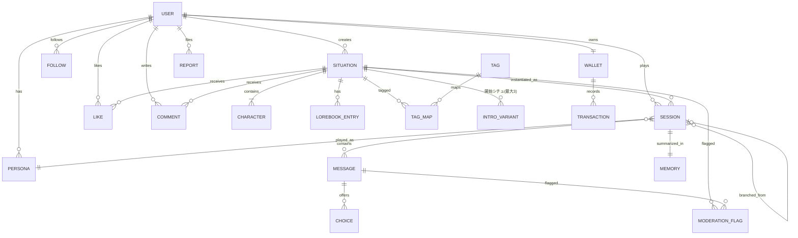

# Teardown: AIキャラチャットアプリ (仮称: bukucha)

- source_urls: [https://kyarapu.com/, https://zeta-ai.io/en]
- date: 2026-08-06
- user_requirements: SPファースト(Web/iOS/Android、PCは中央SPビュー)。本質=ラノベ的連続テキスト体験・ドーパミン設計・没入感・物語分岐・自作シチュエーション・妄想の具現化。シチュエーション先行/キャラ後行。書き手コミュニティ(Pixiv的)が優位性。IP不要。偶然性でなく欲求性ドリブン。
- confidence: medium-high (キャラぷ=公式HTML解析+一次記事で高、Zeta=公式告知+大手報道で高、チャット画面内部はログイン後のため一部推定)
- 生データ: `research/kyarapu.md` / `research/zeta.md` / `research/market-competitors.md`

---

## 1. Positioning

**「妄想を具現化する、書けるラノベ・プラットフォーム」** — 自分の欲望どおりのシチュエーションを1分で立ち上げ、AIとの共作で無限に続く一人称ラノベとして読み進められる。書き手はシチュエーションを公開して読者と承認を獲得する(Pixiv型の両面市場)。

ベンチマークの位置づけ:
- **Zeta** (Scatter Lab): 「インタラクティブ・ナラティブ」を自称。日本でエンタメカテゴリ総利用時間Netflix超え(2026/4)、日本月商約1.2億円(2026/6)、1日平均利用3時間40分(日本)。※ユーザー言及の「月間6億」は公表数値では未確認 — 確認できたのは全社四半期52億ウォン(月平均約2億円)+急成長中で、月商3〜6億円レンジは推定の域
- **キャラぷ** (Wrtn): 「遊ぶ・作る・稼ぐ」。コイン従量課金+クリエイター報酬制度が日本で稼働する数少ない実例
- 両者とも「シチュエーション/プロットが主、キャラが従」への進化を実証済み: Zetaは2026年3月に基本単位を「キャラ」から「プロット(世界観+複数キャラ+ロアブック)」に改称、キャラぷはビジュアルノベル機能を追加 → **ユーザーの「シチュエーションがあってキャラがある」という直観は市場の進化方向と一致** [USER-REQ]

ターゲット(ベンチマークからの示唆): Zetaは10〜20代が87〜90%、日本では女性65%(夢小説・乙女ゲー・推し文化圏)。キャラぷも女性向け恋愛シミュが上位。**日本市場の一次ターゲットは「夢小説・なりきり文化圏の10〜30代女性」+男性向け恋愛層の両建て** [ASSUMED: 両ベンチマークの実績構成から]

## 2. Feature Map

★ = コア機能(本質に直結)

- **読む(消費)**
  - ★ ノベル型チャット: 地の文+「」セリフ混在の連続テキスト。ストリーミング逐次表示
  - ★ 物語操作: 再生成(リロール)、指示付き再生成、AI返信の編集、巻き戻し(範囲削除)、空欄送信=続きを自動生成
  - ★ 分岐: 選択肢カード(AI生成)、複数セッション並行(IFルート/周回)
  - ★ 記憶: 自動要約メモリ+ユーザーノート(恒久設定)。復帰時「前回までのあらすじ」
  - 返信候補(ユーザー側セリフのAI提案 = 文章力の補助輪)
  - ペルソナ(ユーザー側プロフィール: 名前・呼ばれ方・設定)
  - シーン画像のインライン表示(事前登録画像のキーワードトリガー型 = 低レイテンシ) / 音声・リアルタイム画像生成は後回し
- **作る(創作)** ★
  - ★ シチュエーション作成ウィザード: 世界観・イントロ(導入シーン)・初回メッセージ・タグ
  - ★ キャラ設定: 名前・性格・口調・関係性・会話例(few-shot)。1シチュエーションに複数キャラ可
  - ロアブック(固有名詞・設定辞書、文脈注入)
  - AI共作サポート(一文の妄想→設定一式をAIが下書き)
  - 公開/非公開、下書き
- **見つける(発見)**
  - ★ 検索・タグ・ジャンル(欲求性ドリブン: 「#幼なじみ」「#溺愛」等の欲望タグを第一階級に) [USER-REQ]
  - ランキング(期間別・ジャンル別、会話量ベース)、セクション型ホームフィード
- **つながる(ソーシャル)** ★
  - いいね、コメント、フォロー、作者プロフィールページ
  - クリエイターダッシュボード(会話数・読者数・いいね推移)
  - (将来) 投げ銭・利用量連動報酬・コンテスト
- **続ける(リテンション)**
  - デイリーログインボーナス、文脈連動プッシュ通知、未読/続きバッジ
- **払う(マネタイズ)**
  - アプリ内通貨、通貨購入、無料獲得(広告リワード等)、(将来)サブスク
- **守る(基盤)**
  - 認証(Google/Apple/LINE/メール)、年齢確認+安心フィルター、モデレーション(入出力)、通報、規約/特商法/資金決済法表記

## 3. Screen Inventory

由来: K=キャラぷで確認、Z=Zetaで確認、N=新規提案

| ID | Screen | Purpose | Key UI | Nav to | 由来 |
|---|---|---|---|---|---|
| SCR-001 | オンボーディング | 初回の嗜好取得と即体験 | 性別向け/ジャンル選択チップ→おすすめ作品3件提示→即チャット導線。登録は後置き | SCR-006 | N (Z/Kは登録先行) |
| SCR-002 | ホーム | 発見・回遊 | 検索バー、欲望タグチップ列、セクション型カード縦フィード(注目/新着/フォロー新作/ランキング上位)、カード=表紙+タイトル+一言+タグ+読者数 | SCR-003/004/005 | K, Z |
| SCR-003 | 検索/タグ | 欲求性ドリブンの到達 | キーワード検索、タグ一覧、ジャンル/男性向け/女性向けフィルタ、並び替え | SCR-005 | K, Z |
| SCR-004 | ランキング | 社会的証明・競争 | 期間タブ(今日/週間/全体)×ジャンル、会話量ベース | SCR-005 | K, Z |
| SCR-005 | 作品詳細(シチュエーション) | 開始前の「あらすじページ」 | 表紙、タイトル、世界観紹介、登場キャラカード、タグ、読者数/いいね、イントロ冒頭プレビュー(小説風)、開始シチュエーション選択(最大3)、**「はじめる」CTA**、コメント欄、作者リンク | SCR-006/013 | K, Z |
| SCR-006 | ★ノベルチャット画面 | 本体験 | フルスクリーン没入(ナビ最小化)。地の文+セリフの連続テキストをストリーミング表示、`*〜*`地の文入力、選択肢カード、返信候補、空欄送信=続き生成、リロール/指示付き再生成、返信編集、長押し巻き戻し、シーン画像インライン、右上メニュー(記憶/ユーザーノート/設定修正/新ルート開始) | SCR-005/008/015 | K, Z |
| SCR-007 | 履歴(本棚) | 再開・積読管理 | 進行中の物語リスト(表紙+「前回までのあらすじ」+未読/続きバッジ)、タブ(進行中/完結/お気に入り) | SCR-006 | K, Z(トーク一覧を「本棚」メタファに変更) |
| SCR-008 | ルート管理(分岐マップ) | IF周回の可視化 | 同一作品のセッション一覧、分岐点ラベル、新ルート作成、[将来]ツリー表示 | SCR-006 | Z(保存100件)を明示UI化 [USER-REQ: 分岐を作れる] |
| SCR-009 | ★シチュエーション作成 | UGCの核 | ウィザード: ①妄想を一文で入力→AIが世界観/イントロ/キャラ案を下書き ②世界観・イントロ・初回メッセージ編集 ③キャラ追加(SCR-010) ④タグ・カテゴリ ⑤公開設定。プレビュー(テスト会話) | SCR-010/012 | K(5ステップ), Z(プロット) [USER-REQ: シチュエーション先行] |
| SCR-010 | キャラ編集 | 作成内サブ画面 | 名前・画像(アップロード/AI生成)・性格・口調・関係性・会話例・おすすめ返答(3)・呼び方 | SCR-009 | K, Z |
| SCR-011 | ロアブック編集 | 世界観の深掘り | キーワード+説明+同義語、トリガー時の注入設定 | SCR-009 | Z(로어북), K(キーワードブック) |
| SCR-012 | マイ作品/ダッシュボード | 書き手の承認ループ | 作品リスト(公開状態/読者数/いいね/コメント)、簡易アナリティクス(日次読者数グラフ)、下書き | SCR-009/013 | K(マイキャラ)+N(分析強化) [USER-REQ: 書き手が主役] |
| SCR-013 | 作者プロフィール(公開) | Pixiv的な作家ページ | アバター、自己紹介、作品グリッド、フォロワー数、フォローボタン | SCR-005 | K(/following)+N [USER-REQ] |
| SCR-014 | マイページ | アカウントハブ | プロフィール/ペルソナ管理、いいね一覧、フォロー一覧、通貨残高、設定導線 | SCR-015/018 | K, Z |
| SCR-015 | 通貨・購入 | マネタイズ | 残高(購入分/ボーナス分の分別表示)、パッケージ一覧、履歴、返金ポリシー | 決済 | K(/gold), Z(ピース) |
| SCR-016 | 無料獲得 | 無課金導線 | デイリーボーナス受取、ミッション(通知オン/初作成等)、[将来]広告リワード | SCR-015 | K, Z(무료충전소) |
| SCR-017 | ログイン/登録 | 認証 | Google/Apple/LINE/メール | SCR-002 | K, Z |
| SCR-018 | 設定 | 安全と嗜好 | アカウント、生年月日/年齢確認(安心フィルター切替)、通知設定、テーマ(ダーク対応)、規約リンク | - | K(安心フィルター), Z(年齢認証) |
| SCR-019 | 通知一覧 | 再訪の入口 | キャラからの続き通知、いいね/コメント/フォロー通知、運営告知 | SCR-006/012 | Z, K |
| SCR-020 | 規約・特商法・お知らせ | 法令対応 | 利用規約/プライバシー/特商法/資金決済法表記、運営告知 | - | K, Z |

PCビュー: 全SCRを中央固定幅(~480px)のSPビューで表示。左右は背景(ブランド演出)。SCR-009(作成)のみ将来的に広幅化を検討 [USER-REQ: PC中央SPビュー]。

## 4. User Flows

- **FLOW-1 初回体験(登録前に没入)**: SCR-001(嗜好選択) → SCR-002 → SCR-005(あらすじで期待醸成) → SCR-006(数ターン無料体験) → 登録壁(SCR-017、履歴保存をフックに) → SCR-006継続
- **FLOW-2 読む(欲求性ドリブン回遊)**: SCR-002/003(タグ検索「#溺愛」) → SCR-005 → SCR-006(読む→選択肢→分岐) → 中断 → SCR-019(文脈プッシュ) → SCR-007(あらすじで復帰) → SCR-006
- **FLOW-3 作る(妄想の具現化)**: SCR-012 → SCR-009(一文入力→AI下書き→編集) → SCR-010(キャラ) → SCR-011(ロアブック) → テスト会話 → 公開 → SCR-005(自作の作品ページ) → SCR-012(読者数が伸びる通知=承認ドーパミン)
- **FLOW-4 課金**: SCR-006(通貨枯渇 or 高品質モード誘導) → SCR-016(無料獲得を先に提示=善意設計) → SCR-015(購入) → SCR-006復帰(中断最小)
- **FLOW-5 IF周回**: SCR-007 → SCR-008(別ルート開始「もしあの時…」) → SCR-006(同一シチュエーションの並行世界)

## 5. Data Model (estimated)

要点:
- **SITUATION(シチュエーション)が第一階級エンティティ**。CHARACTERはその子 [USER-REQ]
- SESSIONが「1本のルート」。`branched_from`(自己参照)+分岐点message_idで分岐マップを表現
- MEMORY = 自動要約(rolling summary)+ユーザーノート(恒久)+[将来]ベクタ検索アーカイブ(MemGPT型3層)
- WALLETは購入残高とボーナス残高を分別(資金決済法: ボーナス分は前払式支払手段非該当、購入分は残高1,000万円/供託の管理対象。ボーナスに6ヶ月〜1年の期限)
- 集計フィールド: situation.{like_count, session_count, reader_count, comment_count}(ランキング・カードに表示)

## 6. Pricing

ベンチマーク比較:

| | Zeta | キャラぷ |
|---|---|---|
| 基本会話 | 無制限無料+広告(自社SLMだから成立) | コイン従量(2〜24G/通、1G≒1円) |
| 通貨 | ピース(¥300〜15,000)。上位モデル/画像/ボイスに消費 | ゴールド(¥280〜14,000)。全チャットに消費 |
| サブスク | zeta pass ₩10,900/月(Web安売りでストア手数料回避): 広告除去・月200ピース・優先応答 | なし(レビューで月額要望多数) |
| 無料獲得 | 広告視聴3ピース/日、クイズ、ログボ | ログボ24G/日、登録320G、ミッション、通知オン30G |
| クリエイター | 恒常報酬なし(承認+コンテスト+IP化) | チャット毎G還元+月次報酬+認定制度 |

提案 [ASSUMED: 外部LLM API利用前提のコスト構造から]:
- Zeta型「無制限無料」は自社モデルなしでは原価割れで不成立。**キャラぷ型の通貨従量を基本にしつつ、サブスク(広告なし・毎日パスで実質定額)を初期から用意**(キャラぷの最大の不満=従量の心理的負担を刺す)
- 無料枠: 登録ボーナス+デイリーボーナスで「毎日20〜30ターンは無料で読める」水準 → 習慣形成優先
- 課金トリガー: 高品質モデル(記憶力・文章力の体感差)、続きが気になる場面での残高枯渇、ルートスロット追加、[将来]応援投げ銭
- Web決済を初期から用意(ストア手数料15〜30%回避。Zeta/キャラぷ両方が実施済みの定石)

## 7. AI-Native Opportunities

具体的な機能単位で:

1. **妄想→シチュエーション自動下書き** (SCR-009): 「上司の女騎士が実は…」の一文から、世界観・イントロ(小説冒頭)・キャラ設定・口調サンプル・開始シチュ3種・タグまでAIが一括生成し、ユーザーは編集するだけ。Zetaでユーザーが外部のAIで設定を作って貼る行動が既に発生 → それを内製化。「作れる人」の母数を桁で増やし書き手供給の堀を作る [USER-REQ: 妄想の具現化]
2. **選択肢の投機的先読み生成** (SCR-006): 選択肢提示と同時に裏で各分岐の次応答を生成開始。タップ瞬間に文章が流れ出す=ドーパミンのレイテンシをゼロにする。ベンチマーク未実装の体感差別化
3. **文脈連動プッシュ「キャラからの手紙」** (SCR-019): 要約メモリから未回収の伏線・関係性を拾い、「昨日の続き、待ってる」ではなく物語内文脈の一文(例:「…あの返事、まだ聞いてない」)を通知に載せる。汎用通知の数倍のCVRという業界知見あり
4. **復帰時「前回までのあらすじ」自動生成** (SCR-007): 中断セッションをラノベの「前巻までのあらすじ」形式で要約表示 → 再没入コストを最小化。長い中断ほど効く
5. **IFルート提案** (SCR-008): 会話履歴から分岐可能点をAIが検出し「もしあの時、手を取っていたら…」を提案 → 同一シチュエーションの再消費(周回プレイ)を誘発。1作品あたりLTVを伸ばす
6. **公開前AI品質チェック** (SCR-009): キャラ設定に対しAIがテスト会話を自動生成し、口調ブレ・設定矛盾・規約リスクを事前指摘。人手審査(キャラぷは審査制)を自動化しつつクリエイター体験を向上
7. **返信候補=文体補助輪** (SCR-006): ユーザー側のセリフ+地の文を3案提案(Zetaの50回/日制限付き機能)。「文章力がない読者」を「書ける読者」に段階的に変換し、読者→書き手の転換ファネルとして設計する
8. **欲望タグの自動抽出**: 作品本文・会話ログから「#執着」「#身分差」等の欲望タグをAIが自動付与 → 検索の欲求性マッチ精度を上げる(タグ付けはクリエイターの手作業に頼らない)

## 8. Copy / Drop / Change

### Copy(そのまま踏襲)
| 項目 | 理由 |
|---|---|
| ノベル文体の応答(地の文+「」セリフ)、`*〜*`記法 | 両ベンチマークで実証済みの没入の核。デファクト記法 [USER-REQ: ラノベ] |
| リロール/編集/巻き戻し/空欄送信 | Zetaの「補助輪UX」が勝因の一つと報道されている |
| シチュエーション(プロット)>キャラの階層 | Zetaの2026年方針転換と一致 [USER-REQ] |
| ロアブック | 世界観の深さ=長期没入。SillyTavern以来のデファクト |
| 要約メモリ+ユーザーノートの二層記憶 | キャラぷ実装。記憶がリテンションの核という業界知見 |
| タグ/ランキング/いいね/コメント/フォロー | 承認ループの標準部品 |
| デイリーボーナス+ミッション | 習慣形成の標準。通貨分別管理(資金決済法)ごと踏襲 |
| Google/Apple/LINE/メール認証、Web決済併用 | 国内定石 |
| 安心フィルター(デフォルトON+年齢確認で緩和) | キャラぷ/Zeta両方の着地点。ストア審査対応 |

### Drop(捨てる)
| 項目 | 理由 |
|---|---|
| 音声通話・TTS | 本質(テキスト没入)から外れる。Zetaでも補助機能。MVP後に検討 [USER-REQ: 本質はラノベ] |
| リアルタイム画像生成 | コスト大・レイテンシ大。キャラぷ式「事前登録画像のトリガー表示」で代替 |
| 有名IP・公認キャラ | IP不要が方針。二次創作容認はZetaの法務リスクでもある [USER-REQ] |
| ガチャ/カードコレクション(Talkie型) | 偶然性ドリブンの装置。本プロダクトは欲求性ドリブン [USER-REQ] |
| グループチャット(複数AI同時応答) | 複雑度高。シチュエーション内マルチキャラ(1応答内で複数キャラが動く)で代替 |
| 広告モデル | 外部API原価では成立しない(Zetaは自社SLM前提)。広告リワードのみ将来検討 |
| チャットモード5種(キャラぷ型の複雑な従量) | 選択のストレス。標準/高品質の2段に簡約 |

### Change(変えて取り込む)
| 項目 | ベンチマーク | 変更 |
|---|---|---|
| トーク一覧 | メッセンジャー風リスト(K/Z) | **「本棚」メタファ**: 表紙+あらすじ+続きバッジ。ラノベの積読体験に再解釈 [USER-REQ] |
| 分岐 | Zetaは保存100件の暗黙的並行世界 | **ルート管理を明示UI化**(SCR-008)。「自分で物語の分岐を作れる」を売りに昇格 [USER-REQ] |
| 作成の単位 | キャラぷ=キャラ作成、Zeta=プロット | **最初から「シチュエーション作成」のみ**。単体キャラ作成という概念を持たない [USER-REQ] |
| 作成の難度 | フォーム手入力(1分〜) | **一文の妄想→AI下書き**を標準経路に(§7-1) |
| クリエイター報酬 | Zeta=なし(疲弊の不満)、キャラぷ=通貨還元 | 初期は承認(ダッシュボード/ランキング/バッジ)を厚く、**報酬制度はキャラぷ型を後発実装**(初期は流動性がなく原資も出ない) [USER-REQ: 書き手を集め続ける] |
| 発見面 | 推薦フィード中心(Z) | **検索・タグを一等地に**。「今日の気分の欲望」から最短到達。推薦は従 [USER-REQ: 欲求性] |
| オンボーディング | 登録先行(K/Z) | **体験先行**: 登録前に数ターン読ませてから登録壁(FLOW-1) |

## 9. MVP Scope Proposal (2週間)

**MVPの検証仮説**: 「シチュエーション起点のノベル型AIチャットは、日本の夢小説/なりきり層に刺さり、1セッション30分以上の没入を作れるか」

### In (P0)
- SCR-002(簡易ホーム: 運営シード作品20〜30本+タグ) / SCR-003(タグ・検索) / SCR-005(作品詳細) / **SCR-006(ノベルチャット: ストリーミング、リロール、巻き戻し、空欄送信、選択肢、要約メモリ)** / SCR-007(本棚+あらすじ復帰) / SCR-009+010(作成ウィザード+AI下書き、公開/非公開) / SCR-012(簡易マイ作品) / SCR-014 / SCR-017(Google/Apple/メール) / SCR-018(年齢確認+安心フィルター) / SCR-020(規約類)
- いいね+読者数表示(コメントはP1)
- Web(Next.js PWA、SPファースト・PC中央480px)。iOS/AndroidはP1でCapacitor等によるラップ [USER-REQ]
- LLM: 外部API(高品質1モデルで開始、コスト計測)。モデレーション(入出力フィルタ+通報)
- 無料枠のみ(課金なし。ターン数のみ計測して課金設計の実測材料に)

### Out (P1以降)
- 課金(SCR-015/016)、通知(SCR-019)、SCR-008ルート管理の明示UI(P0は「新しく始める」のみ)、SCR-011ロアブック、SCR-013作者ページ、コメント、フォロー、ランキング、画像トリガー、返信候補、ネイティブアプリ申請、クリエイター報酬

### 成功指標(MVP)
- D1リテンション、平均セッション時間(目標30分+)、1ユーザーあたりターン数、作成完遂率(作成開始→公開)、読者/書き手比率

---

## Appendix: Open Questions [要確認]

1. **NSFW/センシティブの深度**(事業戦略の最重要分岐): (a) キャラぷ型「安心フィルター+寸止め」でストア3面展開、(b) Zeta型「成人認証+アンリミット」をWeb版のみで持つ、(c) 全年齢完全健全。Apple 2026年6月改定でAIチャットの年齢レーティング審査が厳格化しており、(b)はWeb/ストアの二面運用が必須
2. **課金モデルの最終形**: §6提案(通貨従量+サブスク併用)で良いか。価格帯の意向は?
3. **ターゲットの初手**: 女性向け(夢小説層)に絞って開始か、男性向け併設か。シードコンテンツの制作方針に直結
4. **二次創作の扱い**: IP不要方針だが、ユーザーは二次創作を投稿してくる(Zetaはデファクト容認で権利リスクを抱える)。禁止/黙認/明示ガイドラインのどれか
5. **クリエイター報酬の時期と原資**: 初期は承認のみ→どの規模で金銭報酬を入れるか
6. **LLM選定**: 外部API(品質高・原価高)か、将来の自社/OSSモデル(Zetaの構造優位はここ)か。原価目標(1ターンあたり許容コスト)は?
7. **市場**: 日本のみで開始で良いか
8. **プロダクト名**: リポジトリ名「bukucha」をプロダクト名として使うか
9. **キャラ画像**: MVPでAI画像生成を入れるか、アップロード+運営素材のみで開始か
10. **Zeta「月間6億円」の出典**: 公表数値では未確認(§1)。ユーザーの情報源があれば教えてほしい
